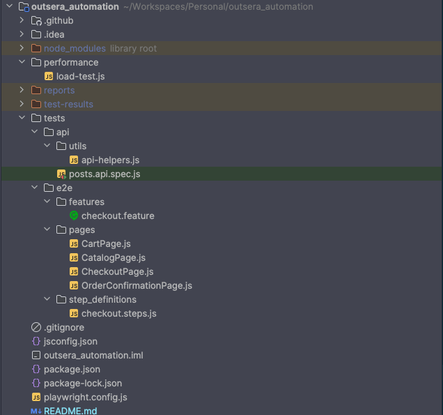

# 🚀 Outsera QA Automation Challenge

Este projeto foi desenvolvido como parte de um teste técnico para a Outsera, com o objetivo de demonstrar domínio prático em **automação de testes**, **engenharia de qualidade** e **estratégias modernas de validação em pipelines CI/CD**.

A solução vai além da implementação básica de testes, abordando **confiabilidade, escalabilidade e observabilidade** — pilares essenciais para ambientes de produção.

---

## 🎯 Objetivo

Construir uma suíte de testes automatizados cobrindo:

- Testes de **API**
- Testes **E2E Web**
- Testes de **Performance**
- Execução contínua via **CI/CD**

Com foco em:

- Cobertura funcional e não funcional
- Boas práticas de engenharia de testes
- Pipeline reprodutível e confiável

---

## 🔗 Repositório

👉 https://github.com/ErikLimaQA/outsera_automation

---

## 🧠 Arquitetura da Solução

A automação foi estruturada em camadas independentes, permitindo isolamento, manutenção e evolução contínua:



---

## 🛠️ Stack Tecnológica

| Categoria        | Ferramenta |
|----------------|----------|
| Testes de API  | Playwright |
| Testes E2E     | Playwright + Cucumber |
| Performance    | K6 |
| CI/CD          | GitHub Actions |

---

## 🔄 Pipeline CI/CD

O pipeline foi projetado para simular um fluxo real de qualidade contínua.

### Disparadores

- Push na branch `main`
- Pull Requests

### Jobs executados

1. **API Testing**
2. **E2E Testing**
3. **Mobile Testing (Maestro)**
4. **Performance Testing (K6)**

### Outputs

- Relatórios HTML/JSON
- Evidências de falha (screenshots)
- Resultados versionados por execução

👉 Acesse:  
https://github.com/ErikLimaQA/outsera_automation/actions

---

## 🧪 Estratégia de Testes

### 🔌 API Testing (Playwright)

**Objetivo:** Validar contratos e comportamento da API.

**Cobertura:**

- Métodos HTTP: GET, POST, PUT, DELETE
- Cenários positivos e negativos
- Validação de:
    - Status codes
    - Headers
    - Payloads

**Diferencial técnico:**
- Estrutura desacoplada e reutilizável
- Validação orientada a contrato

---

### 🌐 E2E Testing (Cucumber + Playwright)

**Objetivo:** Validar fluxos críticos do usuário final.

#### Cenário 1: Login

- Sucesso: autenticação válida
- Falhas:
    - Credenciais inválidas
    - Campos vazios

#### Cenário 2: Checkout (E-commerce)

- Fluxo completo de compra
- Validação de erros de formulário

**Boas práticas aplicadas:**

- Page Object Pattern
- BDD com Cucumber
- Seletores resilientes
- Assertions robustas
- Sincronização confiável

---

### 📈 Performance Testing (K6)

**Objetivo:** Avaliar comportamento sob carga.

**Cenário:**

- 500 usuários simultâneos
- Duração: 5 minutos
- Operações GET

**Métricas analisadas:**

- Latência (p95)
- Throughput
- Taxa de erro
- Volume de dados

**Resultado (execução real):**

- p95: ~13 ms ✅
- Throughput: ~84 req/s ✅
- Taxa de erro: ~33% ⚠️ (esperado em ambiente mock)

---

## ⚠️ Decisões Técnicas

### Uso de API Mock (JSONPlaceholder)

Optou-se por utilizar uma API pública mockada para simplificar o setup e focar na estratégia de testes.

**Impactos:**

- Dados não persistem
- Respostas inconsistentes (ex: headers)
- Possíveis retornos 500 em cenários negativos

**Mitigação:**

- Thresholds ajustados
- Testes desenhados com tolerância controlada

---

## 📊 Observabilidade e Relatórios

Todos os testes geram artefatos consumíveis:

- Playwright → HTML Report
- Cucumber → HTML Report
- K6 → HTML + JSON

Esses relatórios permitem:

- Diagnóstico rápido de falhas
- Análise de performance
- Rastreabilidade por execução

---

## ⚙️ Execução Local

### Instalação

```bash
npm install
npx playwright install --with-deps
npx playwright test tests/api --project=api
```

```bash
cucumber-js tests/e2e/features
```
```bash
k6 run performance/load-test.js
```
---
## 💡 Evoluções Possíveis

Se este projeto fosse evoluído para produção:

- Integração com ambiente real (API autenticada)

- Testes de contrato com Pact ou similares

- Execução distribuída de carga

- Integração com observabilidade (Datadog / Grafana)

- Testes de resiliência (chaos engineering)

- Testes mobile mais abrangentes

# 📌 Conclusão

Este projeto demonstra uma abordagem estruturada e pragmática para qualidade de software, cobrindo:

- Testes funcionais e não funcionais

- Automação escalável

- Integração contínua

- Análise de desempenho

- Mais do que validar funcionalidades, o objetivo foi construir uma base sólida que reflita práticas utilizadas em ambientes reais de engenharia de qualidade.